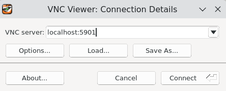
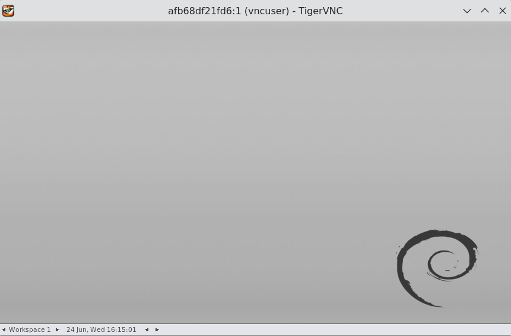
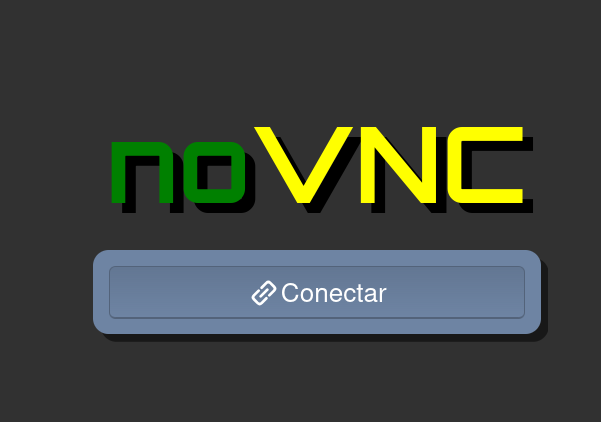
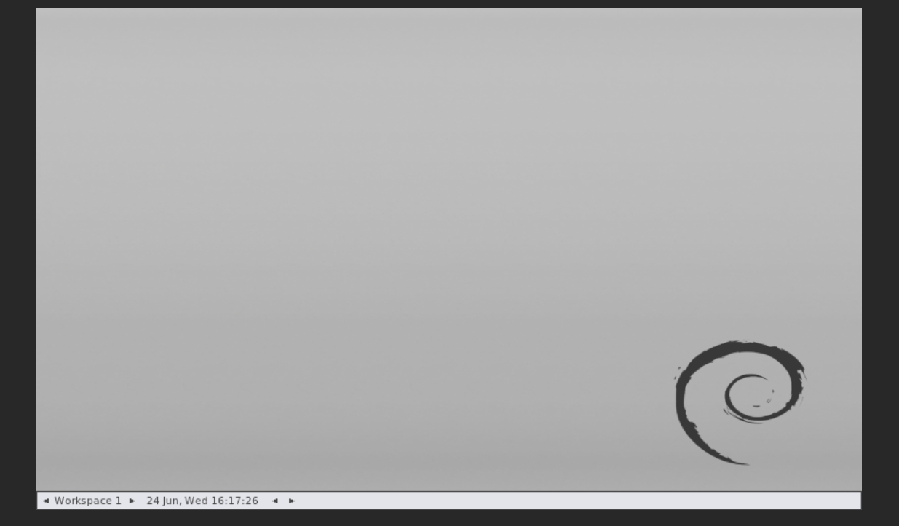
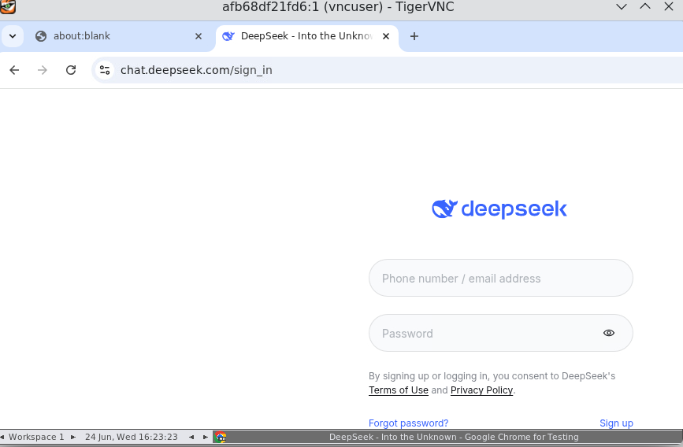

# deepsproxy-x11

Crie a rede net:
````
docker network create --driver=bridge --subnet=172.15.0.0/16 net
````

Suba o projeto:
````
cd /opt
git clone https://github.com/primoitt83/deepsproxy-x11.git
cd deepsproxy-x11
docker-compose up -d
````

Pra conectar, podemos usar:

VNC (por exemplo, tigervncviewer):
````
http://localhost:5901
````


Use a senha listada no compose:
````
123456
````



noVNC via navegador:
````
http://localhost:8080/vnc.html
````




Use a senha listada no compose:
````
123456
````


Teste os endpoints

No terminal:
````
curl http://localhost:3000/health
{"status":"ok"}
````

Verificar os modelos:
````
curl http://localhost:3000/v1/models | jq
  % Total    % Received % Xferd  Average Speed  Time    Time    Time   Current
                                 Dload  Upload  Total   Spent   Left   Speed
100   1030 100   1030   0      0  41629      0                              0
{
  "object": "list",
  "data": [
    {
      "id": "deepseek-v4-flash",
      "object": "model",
      "created": 1782317882,
      "owned_by": "deepseek",
      "permission": [],
      "root": "deepseek-v4-flash",
      "parent": null,
      "context_length": 64000,
      "max_context_tokens": 64000,
      "max_input_tokens": 64000,
      "max_output_tokens": 8000
    },
    {
      "id": "deepseek-v4-flash-thinking",
      "object": "model",
      "created": 1782317882,
      "owned_by": "deepseek",
      "permission": [],
      "root": "deepseek-v4-flash-thinking",
      "parent": null,
      "context_length": 64000,
      "max_context_tokens": 64000,
      "max_input_tokens": 64000,
      "max_output_tokens": 8000
    },
    {
      "id": "deepseek-v4-pro",
      "object": "model",
      "created": 1782317882,
      "owned_by": "deepseek",
      "permission": [],
      "root": "deepseek-v4-pro",
      "parent": null,
      "context_length": 64000,
      "max_context_tokens": 64000,
      "max_input_tokens": 64000,
      "max_output_tokens": 8000
    },
    {
      "id": "deepseek-v4-pro-thinking",
      "object": "model",
      "created": 1782317882,
      "owned_by": "deepseek",
      "permission": [],
      "root": "deepseek-v4-pro-thinking",
      "parent": null,
      "context_length": 64000,
      "max_context_tokens": 64000,
      "max_input_tokens": 64000,
      "max_output_tokens": 8000
    }
  ]
}
````

Ou navegador:

````
http://localhost:3000/health

http://localhost:3000/v1/models
````

Acompanhe os logs do container:
````
cd /opt/deepsproxy-x11

docker-compose logs -f --tail=100

deepsproxy-x11  | ◇ injected env (0) from .env // tip: ⌘ custom filepath { path: '/custom/path/.env' }
deepsproxy-x11  | Playwright initialized.
deepsproxy-x11  | Server is running on port 3000
deepsproxy-x11  | 2026-06-23 17:53:44,059 INFO success: vncserver entered RUNNING state, process has stayed up for > than 1 seconds (startsecs)
deepsproxy-x11  | 2026-06-24 16:13:58,678 INFO supervisord started with pid 11
deepsproxy-x11  | 2026-06-24 16:13:59,682 INFO spawned: 'vncserver' with pid 12
deepsproxy-x11  | 2026-06-24 16:13:59,685 INFO spawned: 'websockify' with pid 13
deepsproxy-x11  | 2026-06-24 16:13:59,687 INFO spawned: 'app' with pid 14
deepsproxy-x11  | Cleaning stale pidfile '/home/vncuser/.vnc/afb68df21fd6:1.pid'!
deepsproxy-x11  | Cleaning stale X11 lock '/tmp/.X1-lock'!
deepsproxy-x11  | Cleaning stale X11 lock '/tmp/.X11-unix/X1'!
deepsproxy-x11  | 2026-06-24 16:13:59,809 INFO success: websockify entered RUNNING state, process has stayed up for > than 0 seconds (startsecs)
deepsproxy-x11  | 2026-06-24 16:13:59,809 INFO success: app entered RUNNING state, process has stayed up for > than 0 seconds (startsecs)
deepsproxy-x11  | WebSocket server settings:
deepsproxy-x11  |   - Listen on :8080
deepsproxy-x11  |   - Web server. Web root: /usr/share/novnc
deepsproxy-x11  |   - No SSL/TLS support (no cert file)
deepsproxy-x11  |   - proxying from :8080 to localhost:5901
deepsproxy-x11  | 
deepsproxy-x11  | New Xtigervnc server 'afb68df21fd6:1 (vncuser)' on port 5901 for display :1.
deepsproxy-x11  | Use xtigervncviewer -SecurityTypes VncAuth,TLSVnc -passwd /tmp/tigervnc.ZwlVLX/passwd afb68df21fd6:1 to connect to the VNC server.
````

Caso precise fazer o login, execute no terminal:

````
cd /opt/deepsproxy-x11

docker-compose exec deepsproxy-x11 /bin/bash

vncuser@afb68df21fd6:~/app$ npm run login

> deepsproxy@1.0.0 login
> npx tsx src/login.ts

Opening DeepSeek to allow login...
Browser opened. Please login to chat.deepseek.com.
Once you are fully logged in and can see the chat interface, close the browser window or press Ctrl+C here.
````

Verifique no VNC ou noVNC;



Faça o login e feche o navegador e pronto!!!
